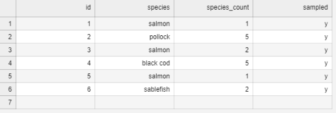
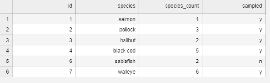
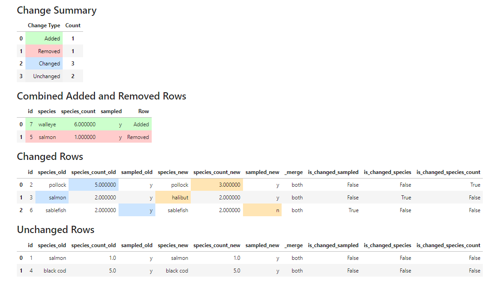

# pandas playground

This project contains various examples of data wrangling within a docker hosted jupyter notebooks. 

If you use pycharm there is a checked-in run configuration for starting jupyter, otherwise you can use the compose file directly.

# simple-diff-examples.ipynb

Given the checked in data sets the summary provides the following. 

    

        <h3>row-all-operations.png</h3>
        
    

    

        <h3>row-all-operations-diff.png</h3>
        
    

